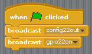
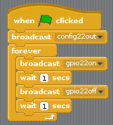

## Контролирайте светодиодите

1. Отвори **Scratch** от менюто за програмиране (**Scratch**, not **Scratch 2**).

2. Кликнете върху **Редактиране** в лентата с менюта и изберете **Стартиране на GPIO сървър**:
    
    

3. Кликнете върху **Контрол** панел. Плъзнете в **при натискане на флаг** блок и две **излъчване** блокове. Докоснете ги заедно в последователност и редактирайте излъчванията, за да кажете `config22out` и `gpio22on` така:
    
    

4. Сега кликнете върху зеления флаг, за да стартирате кода си. Трябва да видите червения светодиод.

5. Сега добавете **чакайте 1 сек** блокирайте преди и след изключване на светодиода с `предаване gpio22off`и го обвийте в **forever** блок да мига непрекъснато:
    
    

6. Щракнете върху зеления флаг отново и трябва да видите LED мига.

7. Сега добавете още **излъчване** блокира, за да въведете другите две светлини и да ги включите и изключите:
    
    

8. Кликнете върху зеления флаг отново и трябва да видите, че трите лампички мигат заедно.

9. Можете ли да промените номера в **чакайте 1 сек** да се ускори или забави последователността?