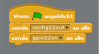

## Steuere die LEDs

\--- task \---

Öffne **Scratch ** aus dem Programmiermenü (**Scratch **, nicht **Scratch 2**).

\--- /task \---

\--- task \---

Klicke auf **Bearbeiten** in der Menüleiste und wähle **Start GPIO-Server**:

\--- /task \---

\--- task \---

Klicke auf die Schaltfläche **Steuerung**. Ziehe einen **wenn Fahne angeklickt** Block und zwei **sende an alle** Blöcke hinein. Docke sie nacheinander an und bearbeite die zwei "sende an alle" Blöcke, indem du `config22out` und `gpio22on` einsetzt. Es sollte nun so aussehen:

\--- /task \---

\--- task \---

Klicke jetzt auf die grüne Flagge, um deinen Code zu starten. Du solltest sehen, dass die rote LED aufleuchtet.

Füge jetzt aus Steuerung **warte 1 Sek.** Blöcke vor und nach dem Ausschalten der LED mit `sende gpio22off an alle`ein. Umgib diese Befehle mit einem **wiederhole fortlaufend** Block, um kontinuierlich zu blinken:

\--- /task \---

\--- task \---

Klicke erneut auf die grüne Flagge und du solltest die LED blinken sehen.

\--- /task \---

\--- task \---

Füge jetzt weitere **sende an alle** Blöcke ein, um auch die beiden anderen LEDs einzuführen und blinken zu lassen:

\--- /task \---

\--- task \---

Klicke erneut auf die grüne Flagge und du solltest sehen, dass alle drei Lichter zusammen blinken.

\--- /task \---

\--- task \---

Kannst du die Zahl in **warte 1 Sek.** ändern, um die Sequenz zu beschleunigen oder zu verlangsamen?

\--- /task \---