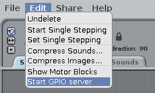

## Kontrolliere die LEDs

1. Öffnen **Scratch** aus dem Programmiermenü (**Scratch**, nicht **Scratch 2**).

2. Klicken Sie auf **Bearbeiten** in der Menüleiste und wählen Sie **GPIO-Server starten**:
    
    

3. Klicken Sie auf **Steuerung** Panel. Ziehen Sie in einem **wenn Flag geklickt wird** block und zwei **broadcast** Blöcke. Docken Sie sie nacheinander an und bearbeiten Sie die Broadcasts, um `config22out` zu sagen und `gpio22on` so:
    
    

4. Klicken Sie nun auf die grüne Flagge, um Ihren Code zu starten. Sie sollten sehen, dass die rote LED aufleuchtet.

5. Fügen Sie jetzt ein **warten Sie 1 Sekunden** Blockieren Sie vor und nach dem Ausschalten der LED mit `broadcast gpio22off`, und verpacken Sie es in ein **forever** blockieren, um kontinuierlich zu blinken:
    
    

6. Klicken Sie erneut auf die grüne Flagge und Sie sollten die LED blinken sehen.

7. Fügen Sie nun weitere **broadcast** hinzu Blöcke, um die anderen beiden Lichter einzuführen und sie alle blinken zu lassen:
    
    

8. Klicken Sie erneut auf die grüne Flagge und Sie sollten sehen, dass die drei Lichter zusammen blinken.

9. Kannst du die Zahl in **warten 1 Sek.** ändern? um die Sequenz zu beschleunigen oder zu verlangsamen?