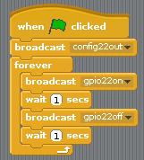

## کنترل LED ها

1. باز **خراش** از منوی برنامه ریزی (**خراش**، نه **خراش 2**).

2. روی 123 | در نوار منو و انتخاب کنید **شروع سرور GPIO**:
    
    

3. روی 123_8_0_321 | کنترل</strong> کلیک کنید پانل در 123 | 13_0_321 | هنگام پرش کلیک کنید</strong> بلوک و دو **پخش** بلوک ها آنها را به صورت دسته ای دسته بندی کنید و برنامه های پخش را ویرایش کنید. `config22out` و `gpio22on` مانند:
    
    

4. برای اجرای کد خود، روی پرچم سبز کلیک کنید. شما باید چراغ قرمز را ببینید.

5. حالا اضافه کنید **انتظار 1 ثانیه** بلوک قبل و بعد از روشن کردن چراغ با `پخش gpio22off`و قرار دادن آن در **برای همیشه 123_9_5_321 | بلوک به طور مداوم چشمک می زند:
 
    
    </li> 
    
    - با کلیک بر روی پرچم سبز دوباره و شما باید چشمک زن LED را ببینید.
    
    - در حال حاضر اضافه کردن برخی دیگر **پخش** بلوک ها برای معرفی دو چراغ دیگر، و آنها را در همه فلش روشن و خاموش:
        
        
    
    - با کلیک بر روی پرچم سبز دوباره و شما باید سه چراغ فلش با هم ببینید.
    
    - آیا می توانید شماره را در **انتظار 1 ثانیه** برای سرعت بخشیدن یا کاهش سرعت دنباله؟</ol>