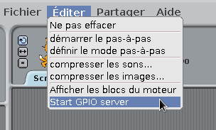
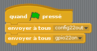
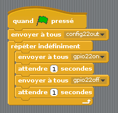
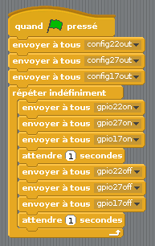

## Control the LEDs

\--- task \---

Open **Scratch** from the Programming menu (**Scratch**, not **Scratch 2**).

\--- /task \---

\--- task \---

Click **Edit** in the menu bar and select **Start GPIO server**:

\--- /task \---

\--- task \---

Click the **Control** panel. Drag in a **when flag clicked** block and two **broadcast** blocks. Dock them together in sequence and edit the broadcasts to say `config22out` and `gpio22on` like so:

\--- /task \---

\--- task \---

Now click the green flag to run your code. You should see the red LED light up.

Now add a **wait 1 secs** block before and after turning the LED off with `broadcast gpio22off`, and wrap it in a **forever** block to blink continuously:

\--- /task \---

\--- task \---

Click the green flag again and you should see the LED blink.

\--- /task \---

\--- task \---

Now add some more **broadcast** blocks to introduce the other two lights, and make them all flash on and off:

\--- /task \---

\--- task \---

Click the green flag again and you should see the three lights flash together.

\--- /task \---

\--- task \---

Can you change the number in **wait 1 secs** to speed up or slow down the sequence?

\--- /task \---