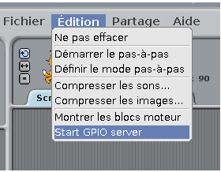
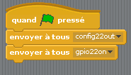
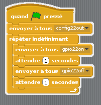
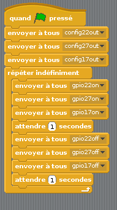

## Contrôle les LED

\--- task \---

Ouvre **Scratch** à partir du menu de programmation (**Scratch **, pas **Scratch 2**).

\--- /task \---

\--- task \---

Clique **Éditer** dans la barre de menu et sélectionne **Start GPIO server**:

\--- /task \---

\--- task \---

Clique sur le panneau **Contrôle**. Fais glisser un bloc **lorsque le drapeau est pressé** et deux blocs **envoyer à tous**. Fixe-les ensemble en séquence et modifie les "envoyer à tous" pour dire `config22out` et `gpio22on` comme ceci:

\--- /task \---

\--- task \---

Maintenant, clique sur le drapeau vert pour exécuter ton code. Tu devrais voir la LED rouge s'allumer.

Maintenant, ajoute un bloc **attendre 1 secondes** avant et après avoir éteint la LED avec `envoyer à tous gpio22off`, et insère-le dans un bloc **répéter indéfiniment** pour clignoter continuellement:

\--- /task \---

\--- task \---

Clique à nouveau sur le drapeau vert et tu devrais voir la LED clignoter.

\--- /task \---

\--- task \---

Maintenant, ajoute d'autres blocs **envoyer à tous** pour introduire les deux autres voyants, et les faire tous s'allumer et s'éteindre:

\--- /task \---

\--- task \---

Clique à nouveau sur le drapeau vert et tu devrais voir que les trois feux clignotent ensemble.

\--- /task \---

\--- task \---

Peux-tu changer le nombre en **attendre 1 secondes** pour accélérer ou ralentir la séquence?

\--- /task \---