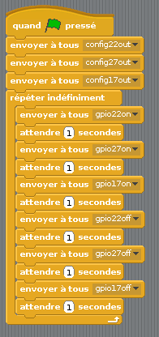

## Séquence de feux de signalisation

\--- task \---

Essaie d'allumer et d'éteindre les lumières dans l'ordre:

\--- /task \---

\--- task \---

Maintenant que tu sais comment contrôler les lumières individuellement, et régler les pauses entre les commandes, peux-tu créer une séquence de feux de signalisation? La séquence est:

- Vert allumé
- Orange allumé
- Rouge allumé
- Rouge et orange allumé
- Vert allumé

Fais attention au minutage. Combien de temps les lumières doivent-elles rester allumées à chaque étape?

\--- /task \---

Une fois que la séquence de feu de signalisation est terminée, tu peux essayer d'ajouter un bouton et un buzzer pour créer un feu de signalisation interactif pour un passage piétons.