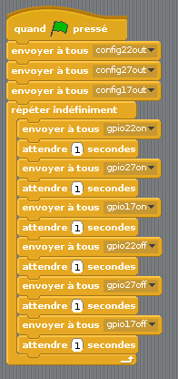

## Séquence de feux de circulation

1. Essayez d'allumer et d'éteindre les lumières dans l'ordre:

1. Maintenant, vous savez comment contrôler les lumières individuellement, et le temps des pauses entre les commandes, pouvez-vous créer une séquence de feux de circulation? La séquence va:
    
    - Vert sur
    - Ambre sur
    - Rouge sur
    - Rouge et ambre sur
    - Vert sur

Il est important de penser au timing. Combien de temps les lumières doivent-elles rester allumées à chaque étape?

Une fois la séquence de feu de circulation terminée, vous pouvez essayer d'ajouter un bouton et un buzzer pour créer un feu de circulation interactif pour un passage pour piétons.