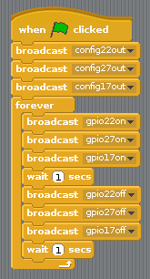

## एल ई डी को नियंत्रित करें

1. ओपन **स्क्रैच** प्रोग्रामिंग मेनू से (**स्क्रैच**, नहीं **स्क्रैच 2**)

2. क्लिक करें **संपादित करें** मेनू बार में और चुनें **प्रारंभ GPIO सर्वर**:
    
    

3. 123_8_0_321 | नियंत्रण</strong> पर क्लिक करें पैनल। एक में खींचें **ध्वज क्लिक किया** ब्लॉक और दो **प्रसारण** ब्लॉक। उन्हें क्रम में एक साथ डॉक करें और कहने के लिए प्रसारण संपादित करें `config22out` और `जीपीआईओ 223` इस तरह:
    
    

4. अब अपना कोड चलाने के लिए हरी झंडी पर क्लिक करें आपको लाल एलईडी लाइट को देखना चाहिए

5. अब जोड़ें **रुको 1 सेकंड** 123_6_2_321 | प्रसारण जीपीआईओ 22 ओफ़ | 123_7_3_321 के साथ एलईडी बंद करने से पहले और बाद में ब्लॉक करें, और उसे 123456788_321 में लपेटें | हमेशा के लिए 123_9_5_321 | लगातार ब्लिंक ब्लॉक करें:
    
    

6. हरा झंडा फिर से क्लिक करें और आपको एलईडी ब्लिंक देखना चाहिए।

7. अब कुछ और जोड़ें **प्रसारण** अन्य दो रोशनी शुरू करने के लिए ब्लॉक, और उन्हें सभी फ्लैश चालू और बंद करें:
    
    

8. हरा झंडा फिर से क्लिक करें और आपको तीन रोशनी को एक साथ फ्लैश देखना चाहिए।

9. क्या आप नंबर में बदल सकते हैं **रुको 1 सेकंड** क्रम में गति या धीमा करने के लिए?