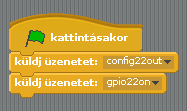

## Vezéreld a LED-eket

\--- task \---

Nyisd meg a **Scratch**-t a Programozás menüből (**Scratch**, ne a **Scratch 2**-t).

\--- /task \---

\--- task \---

Kattints a **Módosítás** menüben a **Start GPIO server** menüpontra:

\--- /task \---

\--- task \---

Válaszd ki a **Vezérlés** panelt. Húzz be egy **kattintáskor** blokkot és kettő **küldj üzenetet** blokkot. Kapcsold őket össze egy szekvenciába és módosítsd az üzeneteket `config22out` és `gpio22on` szövegűre:

\--- /task \---

\--- task \---

És most nyomd meg a zöld zászlót a kódod futtatásához. Látnod kell, hogy a piros LED bekapcsol.

Most adj hozzá egy **várj 1 mp-et** blokkot, egy `küldj üzenetet gpio22out` LED kikapcsoló blokkot, aztán újra egy várakoztató blokkot és csomagold őket egy **mindig** blokkba a folyamatos villogáshoz:

\--- /task \---

\--- task \---

Nyomd meg a zöld zászlót újra és látnod kell a LED felvillan.

\--- /task \---

\--- task \---

Most adj hozzá még **küldj üzenetet** blokkokat és vezéreld velük a másik két lámpát is, kapcsold be és ki őket:

\--- /task \---

\--- task \---

Nyomd meg a zöld zászlót újra és látnod kell mindhárom fényt egyszerre felvillani.

\--- /task \---

\--- task \---

Tudod úgy módosítani a számot a **várj 1 mp-et** blokkban, hogy felgyorsuljon vagy lelassuljon a szekvencia?

\--- /task \---