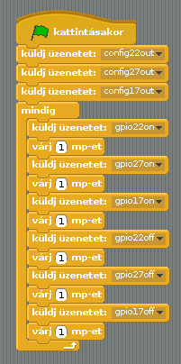

## A közlekedési lámpa ciklusa

\--- task \---

Próbáld meg sorrendben ki és bekapcsolni a lámpákat:

\--- /task \---

\--- task \---

Most, hogy már tudod, hogyan kell egyenként vezérelni a fényeket, és hogyan lehet szünetet rakni a parancsok közé, menni fog a jelzőlámpás ciklus? A fények sorrendje:

- Zöld világít
- Sárga világít
- Piros világít
- Piros és sárga világít
- Zöld világít

Fontos, hogy gondolj az időzítésre. Mennyi ideig világítsanak a fények az egyes szakaszokban?

\--- /task \---

Miután befejezted a jelzőlámpa ciklust, hozzáadhatsz egy gombot és egy csengőt (buzzer), így készíthetsz egy interaktív változatot.