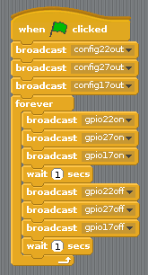

## Irányítsa a LED-eket

1. Nyitott **Scratch** a Programozás menüből (123_8_2_321 | Scratch</strong>, nem **Scratch 2**).

2. Kattintson a 123_8_0_321 | Szerkesztés</strong> gombra a menüsoron, és válassza a **GPIO-szerver indítása**:
    
    

3. Kattintson a **Control** gombra panel. Húzza a (z) 123_8_0_321 címre, amikor a zászlót a 123_9_1_321-re kattintotta blokk és két **broadcast** blokkokat. Dugja össze egymás után egymás után, és írja át az adásokat, hogy mondja meg: 123_6_0_321 | config22out</code> és `gpio22on` így:
    
    

4. Most kattintson a zöld zászlóra a kód futtatásához. A piros LED világít.

5. Add add a 123_8_0_321 | wait 1 mp</strong> blokk előtt és után a LED kikapcsolása `broadcast gpio22off`, és csomagolja be egy **örökké** blokk folyamatosan villog:
    
    

6. Kattintson újra a zöld zászlóra, és látnia kell a LED villogását.

7. Adj hozzá még néhányat **broadcast** blokkolja a másik két lámpa beillesztését, és mindegyik be- és kikapcsolja őket:
    
    

8. Kattints újra a zöld zászlóra, és látnod kell, hogy a három lámpa villog együtt.

9. Módosíthatja a számot **várjon 1 másodpercet** hogy felgyorsítsa vagy lelassítsa a szekvenciát?