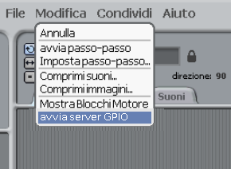
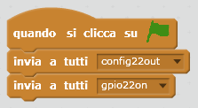
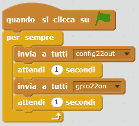
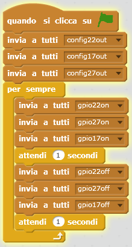

## Controllare i LED

1. Apri **Scratch** dal menu principale (**Scratch**, non **Scratch 2**).

2. Nella barra dei menu, fai click su **Modifica** e seleziona **Avviare il server GPIO**:
    
    

3. Fai click sul pannello **Controllo**. Trascina nel pannello un blocco **quando si clicca su ⚑** e due blocchi **invia a tutti**. Collegarli insieme in sequenza e modificare le trasmissioni per dire `config22out` e `gpio22on` così:
    
    

4. Ora fai clic sulla bandiera verde per eseguire il tuo codice. Dovresti vedere il LED rosso acceso.

5. Ora aggiungi un **wait 1 secs** bloccare prima e dopo aver spento il LED con `broadcast gpio22off`, e avvolgerlo in un **per sempre** blocco per lampeggiare continuamente:
    
    

6. Fai di nuovo clic sulla bandiera verde e dovresti vedere il LED lampeggiare.

7. Ora aggiungine altro **broadcast** blocchi per introdurre le altre due luci e farle accendere e spegnere tutte:
    
    

8. Fai di nuovo clic sulla bandiera verde e dovresti vedere le tre luci lampeggiare insieme.

9. Puoi cambiare il numero in **wait 1 sec** accelerare o rallentare la sequenza?