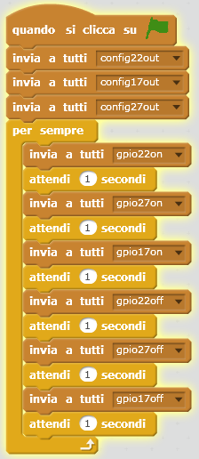

## Il semaforo

1. Prova a far accendere e spegnere le luci in sequenza:

1. Ora sai come controllare le luci individualmente e cronometrare le pause tra i comandi, puoi creare una sequenza di semafori? La sequenza va:
    
    - Verde acceso
    - Ambra
    - Rosso acceso
    - Rosso e ambra
    - Verde acceso

È importante pensare ai tempi. Per quanto tempo dovrebbero rimanere accese le luci in ogni fase?

Una volta completata la sequenza del semaforo, potresti provare ad aggiungere un pulsante e un cicalino per creare un semaforo interattivo per un passaggio pedonale.