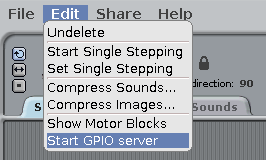

## LEDの制御

1. 開く**スクラッチ**プログラミングメニュー（**スクラッチ**ではなく、**スクラッチ2**）

2. **編集**をクリックします。 **Start GPIO server**を選択します。
    
    

3. **Control**をクリックします。パネル。 **フラグがクリックされたときに**ブロックと2つ**放送**ブロック。 それらを連続してドッキングし、ブロードキャストを編集して`config22out`と`gpio22on`そのようです：
    
    

4. 次に緑色の旗をクリックしてコードを実行します。 赤色のLEDが点灯するはずです。

5. 今すぐ追加**待機1秒** `broadcast gpio22off`でLEDを消す前後でブロックし、**forever**ブロックが連続的に点滅する：
    
    

6. 緑の旗をもう一度クリックすると、LEDが点滅するはずです。

7. もう少し追加する**放送**ブロックを使用して他の2つのライトを導入し、それらのライトをすべてオンまたはオフにします。
    
    

8. 緑色の旗をもう一度クリックすると、3つのライトが一緒に点滅するのがわかります。

9. 数を変更できますか？**待機1秒**シーケンスをスピードアップまたはスローダウンするには？