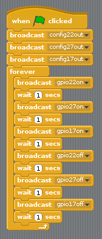

## 交通信号のシーケンス

1. 順番にライトをオンまたはオフにしてみてください：

1. 今度は、ライトを個別に制御する方法を知り、コマンド間の休止時間を計る、信号灯シーケンスを作成することができますか？ シーケンスは次のようになります。
    
    - グリーンオン
    - アンバーオン
    - レッドオン
    - 赤と琥珀色
    - グリーンオン

タイミングについて考えることが重要です。 各ステージでどれくらいの間ライトが点灯し続けるのですか？

信号灯のシーケンスが完了したら、ボタンとブザーを追加して、歩行者の交差点に対話的な信号を発することができます。