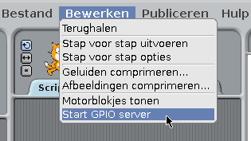
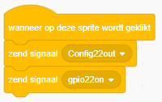

## Bedien de LED's

--- task ---

Open **Scratch** uit het Start menu (**Scratch**, niet **Scratch 2**).

--- /task ---

--- task ---

Klik **Bewerken** in de menubalk en selecteer **Start GPIO-server**:

--- /task ---

--- task ---

Klik op het **Besturen** paneel. Sleep een **wanneer vlag wordt aangeklikt** blok en twee **zend signaal** blokken naar het programma venster. Koppel ze in de juiste volgorde aan elkaar en verander de blokken naar `config22out` en `gpio22on` zoals hier:

--- /task ---

--- task ---

Klik nu op de groene vlag om je code uit te voeren. Je zou de rode LED moeten zien oplichten.

Voeg nu twee **wacht 1 tellen** blokken toe met daartussen een `zend signaal gpio22off` blok en omsluit het geheel met een **herhaal** blok om de LED's continu te laten knipperen:

--- /task ---

--- task ---

Klik nogmaals op de groene vlag en je zou de LED moeten zien knipperen.

--- /task ---

--- task ---

Voeg nu wat meer **zend signaal** blokken toe om de andere twee LED's ook te laten knipperen:

--- /task ---

--- task ---

Klik nogmaals op de groene vlag en je zou alle drie LED's moeten zien knipperen.

--- /task ---

--- task ---

Kun je de tijd in **wacht 1 sec** wijzigen om de reeks te versnellen of te vertragen?

--- /task ---