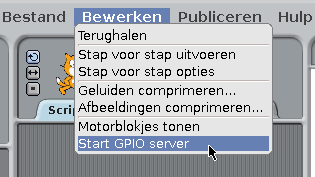
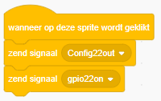
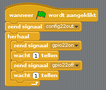
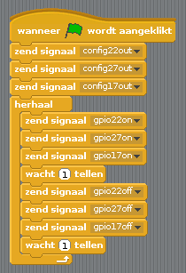

## Stuur de LED's aan

1. Open **Scratch** uit het Start menu (**Scratch**, niet **Scratch 2**).

2. Klik **Bewerken** in de menubalk en selecteer **Start GPIO-server**:
    
    

3. Klik op het **Besturen** paneel. Sleep een **wanneer vlag wordt aangeklikt** blok en twee **zend signaal** blokken naar het programma venster. Koppel ze in de juiste volgorde aan elkaar en verander de blokken naar `config22out` en `gpio22on` zoals hier:
    
    

4. Klik nu op de groene vlag om je code uit te voeren. Je zou de rode LED moeten zien oplichten.

5. Voeg nu twee **wacht 1 tellen** blokken toe met daartussen een `zend signaal gpio22off` blok en omsluit het geheel met een **herhaal** blok om de LED's continu te laten knipperen:
    
    

6. Klik nogmaals op de groene vlag en je zou de LED moeten zien knipperen.

7. Voeg nu wat meer **zend signaal** blokken toe om de andere twee LED's ook te laten knipperen:
    
    

8. Klik nogmaals op de groene vlag en je zou de drie lampjes samen moeten zien flitsen.

9. Kun je waarde in **wacht 1 tellen** wijzigen om het knipperen te versnellen of te vertragen?