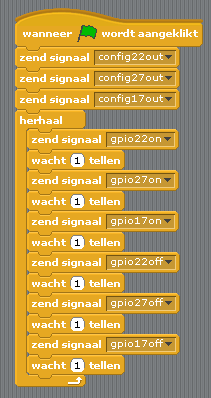

## Verkeerslichten volgorde

\--- task \---

Probeer de lichten achter elkaar in en uit te schakelen:

\--- /task \---

\--- task \---

Nu weet je hoe je de lichten en de pauzes tussen opdrachten afzonderlijk kunt besturen, kun je nu een goede volgorde en tijdsduur voor een verkeerslicht maken? De volgorde is:

- Rood uit, groen aan
- Groen uit, oranje aan
- Oranje uit, rood aan
- Rood en oranje aan
- Groen aan

Het is belangrijk om na te denken over de tijdsduur van elk licht. Hoe lang moet het licht in elke fase aan blijven?

\--- /task \---

Nadat je de volgorde van het verkeerslicht hebt voltooid, kunt je proberen een knop en een zoemer toe te voegen om een ​​interactief verkeerslicht te maken voor een zebrapad.