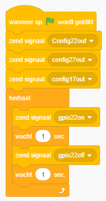
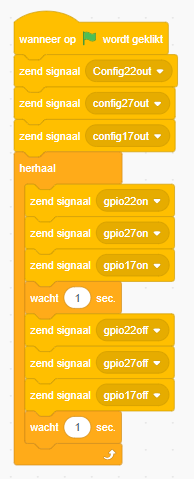

## Stuur de LED's aan

1. Open **Scratch** uit het Start menu (**Scratch**, niet **Scratch 2**).

2. Klik **Bewerken** in de menubalk en selecteer **Start GPIO-server**:
    
    

3. Klik op het **Besturen** paneel. Sleep een **wanneer vlag wordt aangeklikt** blok en twee **zend signaal** blokken naar het programma venster. Koppel ze in volgorde aan elkaar en bewerk de uitzendingen om te zeggen `config22out` en `gpio22on` zoals zo:
    
    

4. Klik nu op de groene vlag om uw code uit te voeren. Je zou de rode LED moeten zien oplichten.

5. Voeg nu een **wait 1 secs** toe blokkeren voor en na het uitschakelen van de LED met `broadcast gpio22off`en verpakken in een **forever** blok om continu te knipperen:
    
    

6. Klik nogmaals op de groene vlag en u zou de LED moeten zien knipperen.

7. Voeg nu wat meer toe **broadcast** blokkeert om de andere twee lichten in te voeren en ze allemaal aan en uit te laten knipperen:
    
    

8. Klik nogmaals op de groene vlag en je zou de drie lampjes samen zien flitsen.

9. Kun je het aantal wijzigen in **wait 1 secs** om de reeks te versnellen of te vertragen?